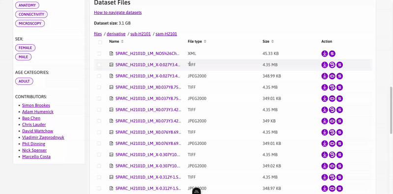
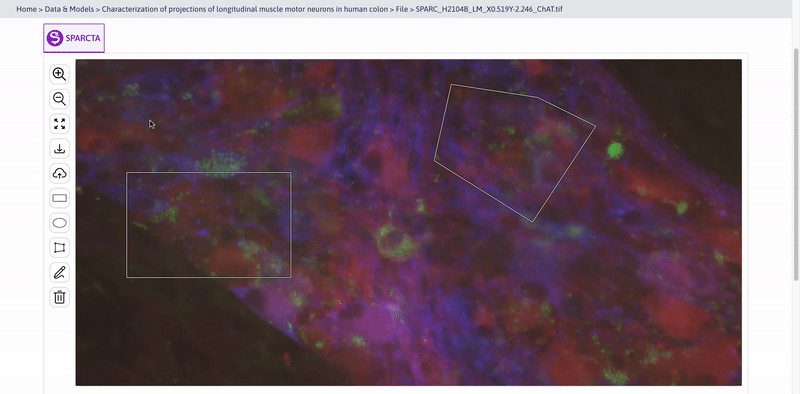

# SPARCTA : SPARC Tiff Annotator

  

# Table of Contents

1.  [Introduction](#introduction)
2.  [Current State](#current-state)
3.  [Our Solution](#our-solution)
4.  [Impact](#impact)
5.  [Architecture](#architecture)
6.  [Using SPARCTA](#using-sparcta)
7.  [Future Directions](#future-directions)
8.  [Reporting Issues](#reporting-issues)
9.  [Team Members](#team-members)

## Introduction

Imagine this: you're exploring the fascinating datasets on the [SPARC portal](https://sparc.science) when you stumble upon a dataset containing some intriguing microscopy images. Curious, you click on the dataset, hoping to quickly browse through some of these images. However, there's a catch: the images are stored in TIFF format, and SPARC doesn’t offer a web-based viewer for these files. But don’t worry: **SPARCTA** is here to save the day!

SPARCTA (SPARC Tiff Annotator) is a web-based viewer for TIFF files that allows users on the SPARC portal to both view and create custom annotations for the TIFF files in SPARC datasets, developed by the Sparctans (Team #6) during the SPARC 2024 Codeathlon. Check out the [Team section](#team-members) for more information on our Team.

## Current State

At present, SPARC portal does not support vieweing TIFF images in their browser, requiring its users to download such files in order to view them. This can be inconvenient, especially when users might want a quick look at the image without needing to download it. The SPARC portal currently uses [BioLucida](https://www.biolucida.net/login) to render image files in browser, but it is currently not available for viewing TIFF images on the SPARC portal. Moreover, BioLucida's web viewer does not allow custom annotations to be made by users who are viewing the image in the web browser, further limiting the ability of the user to explore TIFF images in SPARC datasets.

## Our Solution

In order to tackle these issues, we have developed a web-based viewer for TIFF files with annotation capabilities, called SPARCTA. SPARCTA has the following components and features:
- **TIFF viewer**:
  - Users can freely *preview* TIFF files on the SPARC portal without having to download them.
  - Users can also *zoom* in or out and *pan* across the image, for examining specific features in different parts of the image.
  - SPARCTA also supports a *Full Screen* mode, allowing for detailed examination of the all features presented in the image by the users in one go.
- **Annotations**:
  - Users can create *custom annotations* on top of the image in order to highlight features in the image, tagged by their user name/id.
  - SPARCTA supports *annotation history*, showing the users their previous annotations made in each session.
  - SPARCTA supports *annotations by multiple users* at once, allowing for enhanced collaboration between different users of the SPARC portal.
  - Users can also *save* their annotations for later use in a human-readable format.

SPARCTA directly enhances the FAIRness of TIFF images hosted on the SPARC portal:
- *F*indable: Better exploration of TIFF images on the SPARC portal.
- *A*ccessibility: No need to download TIFF images in order to access them, bringing TIFF images at par with other files such as JPEG images on the SPARC portal.
- *I*nteroperability: SPARCTA stores annotations as json, which can read and interpreted by various other softwares.
- *R*eusability: With custom annotations, SPARCTA allows reusing the same TIFF images by multiple users for exploring many different questions on the same dataset.

## Impact

Currently, images within the SPARC Portal are not capable of being annotated by users. However, with the implementation of SPARCTA, users will be able to annotate images directly in the portal without requiring the download of large image files or the use of customized software. This feature will also enable users to share their thoughts and highlight relevant sections of the images, fostering a collaborative community driven by shared knowledge and understanding.

## Architecture

SPARCTA is a versatile Vue component designed for integration into any Vue-based web application, such as the SPARC Portal. Due to time constraints that prevented an in-depth exploration of the SPARC code base, we conducted a simulation using a mock database, backend, and frontend to evaluate SPARCTA's compatibility with the SPARC Portal.

- **Frontend**: The frontend implementation of SPARCTA aims to replicate the [SPARC Portal App](https://github.com/nih-sparc/sparc-app-2) by integrating the SparctaViewer component for displaying TIFF files. TIFF files are rendered as Deepzoom images through [OpenSeadragon](https://openseadragon.github.io/docs/), with annotations managed using the [Annotorious](https://github.com/annotorious/annotorious-openseadragon) plugin for OpenSeadragon. For more details, see the [frontend README](./frontend/README.md).
- **Database**: Annotations are stored in a simulated SQLite database. Additional information can be found in the [database README](./database/README.md).
- **Backend**: A Flask application currently serves as the backend for SPARCTA, handling the delivery of Deepzoom images from TIFF files to the frontend and managing the storage of annotations in the database. Refer to the [backend README](./backend/README.md) for more details.

## Functionality Overview

### Accessing SPARCTA

SPARCTA can be accessed through the SPARC Portal file tab of any dataset that includes TIFF files. When a dataset contains TIF-related files, an action button to open the SPARCTA Viewer will automatically appear. Please note that, due to the scope of this hackathon, we have only managed to develop the File List and SPARCTA Viewer components separately for demonstration purposes.

### SPARCTA Overview

Upon accessing the SPARCTA Viewer, you'll be greeted with a comprehensive interface designed for viewing TIFF files. The image above showcases the SPARCTA Viewer in action, highlighting its layout and key features.

### Zoom and Pan

SPARCTA includes zoom and pan functionalities, allowing you to navigate through Deepzoom images with ease. This feature is crucial for detailed examination of large TIFF files, as demonstrated in the image above.

### Fullscreen Mode

For an immersive viewing experience, SPARCTA provides a fullscreen mode. This mode enlarges the image to occupy the entire screen, offering a better view of intricate details and annotations.

### Rectangle Annotation

The SPARCTA Viewer supports rectangle annotations, enabling users to highlight specific areas of interest within the image. This tool is useful for marking and identifying regions with clear, defined boundaries.

### Freeform Annotation

In addition to rectangle annotations, SPARCTA allows for freeform and other types of shapes annotations. This feature enables users to draw custom shapes and outlines on the image, providing flexibility for more complex annotations.

### Download and Upload Annotations

Annotations created in SPARCTA can be easily downloaded and saved for future use. This functionality ensures that your annotations can be reused or shared as needed, facilitating continued work and collaboration.

## Using SPARCTA

To experience the current capabilities of the SPARCTA prototype, simply download and run it on your local machine. To do this, follow these setup instructions:

- Launch a Flask server on port 5000 (see [backend README](./backend/README.md))
- Run Vue using `yarn` (see [frontend README](./frontend/README.md))

For detailed guidance on this process, please consult the README files within our frontend and backend directories.

Because of the limited time of the hackathon we haven't fully incorporated all of the backend to the frontend, but the frontend should be usable as a playground to see how SPACTRA Viewer will look like.

## Future Directions

In the future, we will be working towards the following features/removing the following limitations in SPARCTA:
- **Incorporate SPARCTA into the SPARC Portal**: To integrate SPARCTA into the SPARC Portal for production use, follow the necessary steps to embed the SPARCTA component. This involves adapting the SPARCTA Viewer to fit within the existing infrastructure of the SPARC Portal, ensuring compatibility with its data and UI components.
- **Support for multi-dim TIFF**: Currently only 2D grayscale or RGB/RGBA TIFF images are supported, with no support for multi-channel, multi-slice or time-series TIFF images. In the future, we will work towards supporting such images, both the backend for rendering them on the viewer and on the frontend to allow users to explore multi-dimensional TIFF images.
- **Dynamic deepzoom image generation**: Currently, we pre-create the deepzoom copies of each TIFF image, leading to more memory usage. We plan to implement dynamic generation of individual tiles of deepzoom images to alleviate this limitation.
- **Annotation access controls**: Allowing users to control annotation visibility, either keeping them private, making them publicly accessible, or sharing them selectively with other users.
- **Annotation curation**: Allow expert curation of user-/ai-generated annotations in SPARC Portal, where annotations can be accepted or rejected by qualified reviewers.
- **AI-powered Annotation**: Leveraging curated data to train machine learning models and empowering all users to utilize this capability for annotating and exploring new images.
- **Collaborative Annotation**: Allow multiple users to annotate the same image altogether

## Reporting Issues

- If you encounter an issue with SPARCTA, kindly report it by creating a new issue in our GitHub repository.
- We also encourage you to share your solution by submitting a pull request if you've managed to resolve the problem yourself.

## Team Members

- [Haries](https://github.com/hariesramdhani) (Lead, Frontend)
- [Anmol](https://github.com/codemeleon) (Backend, Database)
- [Akram](https://github.com/akram0618) (Database, Documentation)
- [Archit](https://github.com/bhatnagararchit) (Documentation, Backend)

