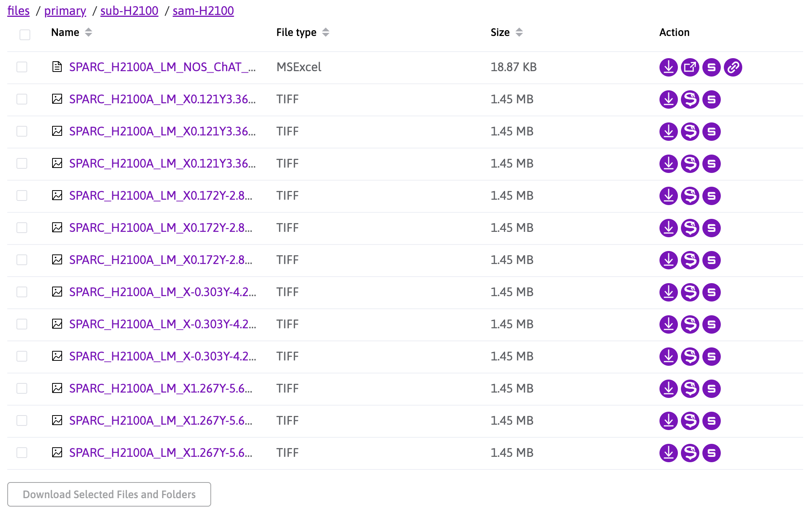

# Frontend

## Introduction
The frontend part of the project derive from the current [SPARC Portal App](https://github.com/nih-sparc/sparc-app-2) to implement new functionality and UI to ease the viewing of TIFF files

## Changes made so far
- [Updated action button behavior](#updated-action-button-behavior-componentsfilestablefilestablevue)
- [New Component for SPARCTAViewer](#new-component-for-sparctaviewer)

### Updated action button behavior (components/FilesTable/FilesTable.vue)
Now if `file type == TIFF` "Open SPACRTA viewer button will appear"

### New Component for SPARCTAViewer

## Related
- [Figma design](https://www.figma.com/design/BCS3rpcSbwLDfVjOcHVGCJ/SPARC-Hackathon-Team-6?node-id=0-1&t=wcMz74B47sOALxnx-1)

## Attribution

- icons: Flaticon
